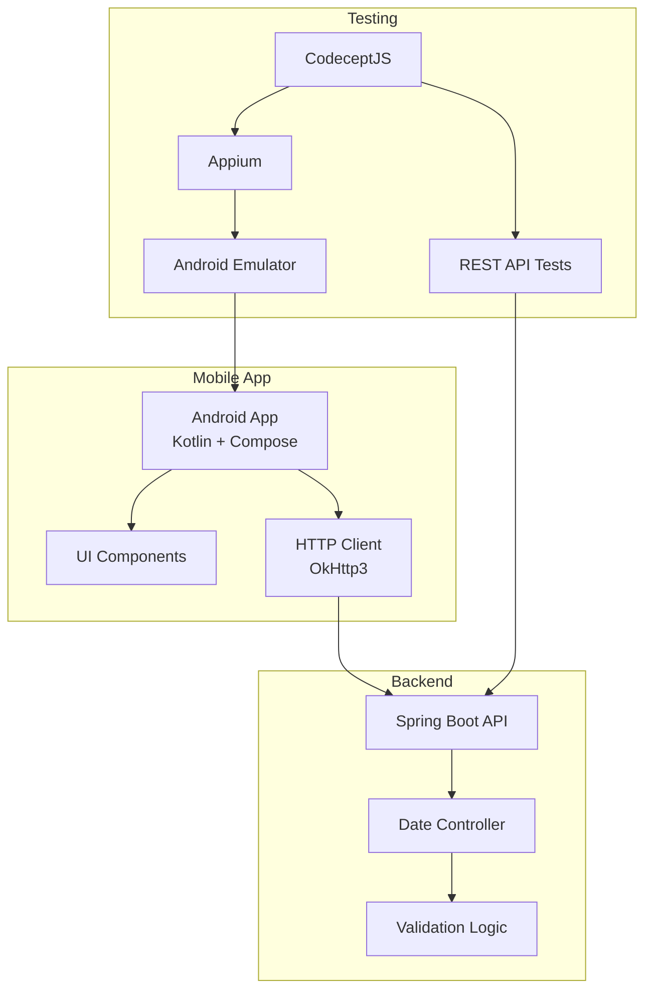
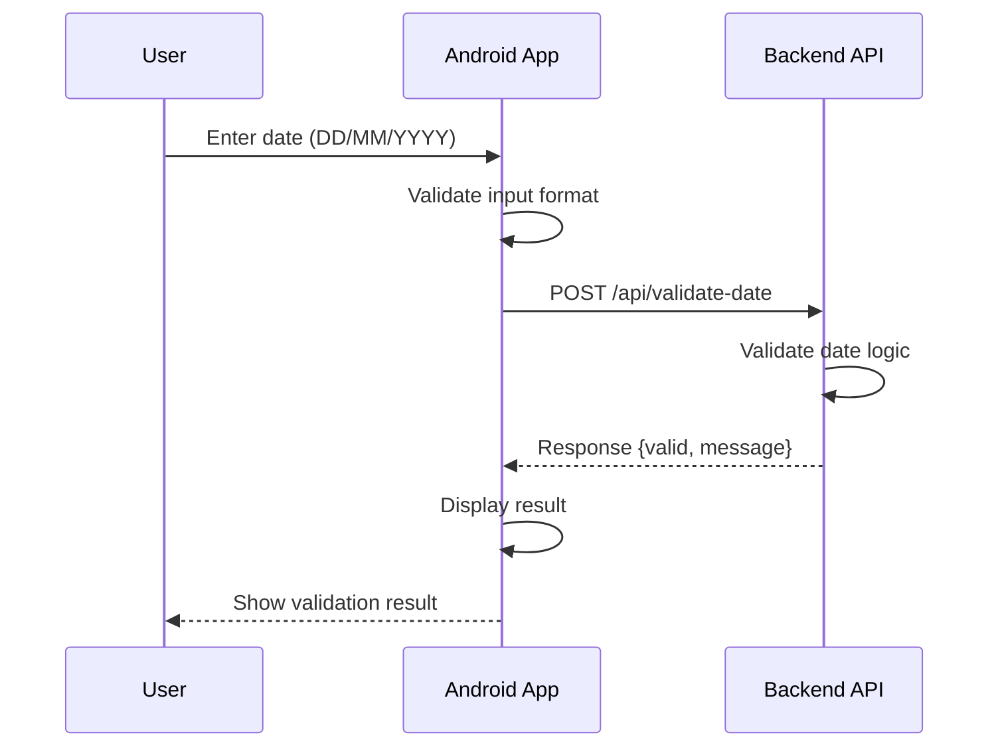
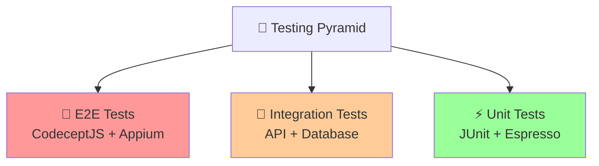
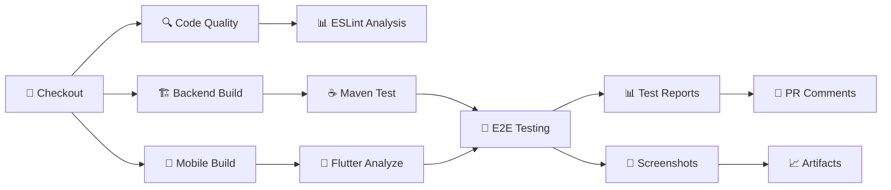

# 📱 Mobile Testing CI/CD - Date Time Checker

[](https://github.com/chube-coder-2k4/Mobile-Testing-CI-CD/actions)
[](https://opensource.org/licenses/MIT)
[](https://developer.android.com/)
[](https://kotlinlang.org/)
[](https://spring.io/projects/spring-boot)
[](https://codecept.io/)

> **Dự án demonstration cho Mobile Testing và CI/CD Pipeline** - Một ứng dụng Android đầy đủ với backend API và hệ thống testing tự động hoàn chỉnh.

## 📋 Table of Contents

- [📖 About the Project](#-about-the-project)
- [🏗️ Architecture](#️-architecture)
- [✨ Features](#-features)
- [📁 Project Structure](#-project-structure)
- [🔧 Prerequisites](#-prerequisites)
- [🚀 Getting Started](#-getting-started)
- [📱 Application Workflow](#-application-workflow)
- [🧪 Testing](#-testing)
- [🔄 CI/CD Pipeline](#-cicd-pipeline)
- [📊 Demo & Screenshots](#-demo--screenshots)
- [🛠️ Configuration](#️-configuration)
- [❓ FAQ & Troubleshooting](#-faq--troubleshooting)
- [🤝 Contributing](#-contributing)
- [📞 Support](#-support)
- [📝 License](#-license)

## 📖 About the Project

Dự án này là một **comprehensive demonstration** của Mobile Testing và CI/CD Pipeline, bao gồm:

- 📱 **Android App** viết bằng Kotlin với Jetpack Compose
- 🖥️ **Spring Boot Backend** với REST API
- 🧪 **Automated Testing Suite** sử dụng CodeceptJS và Appium
- 🔄 **Complete CI/CD Pipeline** với GitHub Actions
- 📊 **Test Reporting** và Quality Gates

Ứng dụng thực hiện chức năng đơn giản nhưng được thiết kế để demo các best practices trong mobile testing và DevOps.

## 🏗️ Architecture

### 📊 System Overview



### 📱 Android App Architecture
- **Language**: Kotlin 🟣
- **UI Framework**: Jetpack Compose 🎨
- **HTTP Client**: OkHttp3 🌐
- **Min SDK**: 29 (Android 10)
- **Target SDK**: 35 (Android 14)
- **Architecture Pattern**: MVVM with Compose

### 🖥️ Backend Architecture
- **Framework**: Spring Boot 3.5.0 🍃
- **Language**: Java 24 ☕
- **Build Tool**: Maven 📦
- **API**: RESTful with JSON
- **Validation**: Custom date validation logic
- **Documentation**: OpenAPI/Swagger integration

#### Backend Components:
1. **DateController**: REST endpoint handler
2. **DateRequest**: Input model (day, month, year)
3. **DateResponse**: Output model (valid, message)
4. **Validation Logic**: Date range and leap year validation

### 🧪 Testing Architecture
- **E2E Testing**: CodeceptJS + Appium 🤖
- **Unit Testing**: JUnit (Backend), Espresso (Android) 
- **API Testing**: REST helper with direct API calls
- **Test Types**: Smoke, Regression, Parallel execution
- **Reporting**: Mochawesome with screenshots

## ✨ Features

### 🎯 Core Features
- ✅ **Date Validation**: Comprehensive date validation with leap year support
- 🎨 **Modern UI**: Beautiful Jetpack Compose interface
- 🌐 **API Integration**: RESTful backend communication
- 🧪 **Complete Testing**: Unit, Integration, and E2E tests
- 🔄 **CI/CD Pipeline**: Automated testing and deployment
- 📊 **Test Reporting**: Detailed test reports with screenshots

### 📝 Validation Rules
- ✅ Day range: 1-31
- ✅ Month range: 1-12  
- ✅ Year range: 1000-3000
- ✅ Leap year calculation
- ✅ Invalid date detection (e.g., Feb 30)
- ✅ Non-numeric input handling

## 📁 Project Structure

```
Mobile-Testing-CI-CD/
├── 📱 app/                                    # Android Application
│   ├── src/
│   │   ├── main/
│   │   │   └── java/com/example/date_time_checker_mobile/
│   │   │       └── MainActivity.kt           # Main UI with Compose
│   │   ├── test/                             # Unit tests
│   │   └── androidTest/                      # Instrumented tests
│   ├── build.gradle.kts                      # Android build configuration
│   └── proguard-rules.pro
│
├── 🖥️ backend/                               # Spring Boot Backend
│   ├── src/
│   │   ├── main/java/com/fpt/superapp/endtoend/
│   │   │   ├── EndToEndApplication.java      # Spring Boot main class
│   │   │   ├── DateController.java           # REST API controller
│   │   │   ├── DateRequest.java              # Request model
│   │   │   └── DateResponse.java             # Response model
│   │   └── test/                             # Backend unit tests
│   ├── pom.xml                               # Maven configuration
│   └── mvnw, mvnw.cmd                        # Maven wrapper
│
├── 🧪 tests/                                 # E2E Testing
│   └── date_time_checker_test.js             # CodeceptJS test scenarios
│
├── 🔧 Configuration Files
│   ├── codecept.conf.js                      # CodeceptJS configuration
│   ├── steps_file.js                         # Custom test steps
│   ├── package.json                          # Node.js dependencies
│   ├── settings.gradle.kts                   # Gradle settings
│   └── build.gradle.kts                      # Root build configuration
│
├── 🔄 .github/workflows/                     # CI/CD Pipelines
│   ├── mobile-ci.yml                         # Main CI/CD pipeline
│   ├── pr-testing.yml                        # PR validation
│   ├── nightly-tests.yml                     # Scheduled testing
│   └── ...                                   # Other workflow files
│
└── 📄 Documentation
    ├── README.md                             # This file
    ├── WORKFLOWS.md                          # CI/CD documentation
    └── .gitignore                            # Git ignore rules
```

## 🔧 Prerequisites

### 🖥️ Development Environment

| Tool | Version | Purpose | Installation Link |
|------|---------|---------|-------------------|
| **Android Studio** | Hedgehog+ | Android development | [Download](https://developer.android.com/studio) |
| **JDK** | 11+ (recommended 17) | Java development | [Download](https://www.oracle.com/java/technologies/downloads/) |
| **Node.js** | 18+ | Testing framework | [Download](https://nodejs.org/) |
| **Git** | Latest | Version control | [Download](https://git-scm.com/) |

### 📱 Mobile Testing Requirements

| Tool | Version | Purpose |
|------|---------|---------|
| **Appium** | 2.0+ | Mobile automation |
| **Android SDK** | API 29+ | Android development |
| **Android Emulator** | AVD with Google APIs | Testing target |

### 🛠️ Installation Commands

```bash
# Install Node.js dependencies for testing
npm install -g @appium/cli appium-doctor

# Install Appium drivers
appium driver install uiautomator2

# Verify Appium setup
appium-doctor --android

# Install CodeceptJS globally (optional)
npm install -g codeceptjs
```

### ✅ Verification Checklist

- [ ] Android Studio installed and configured
- [ ] Java 11+ available (`java -version`)
- [ ] Node.js 18+ installed (`node --version`)
- [ ] Android SDK configured with API 29+
- [ ] Appium installation verified (`appium-doctor --android`)
- [ ] Git configured with your credentials

## 🚀 Getting Started

### 📋 Quick Setup (5 minutes)

```bash
# 1. Clone the repository
git clone https://github.com/chube-coder-2k4/Mobile-Testing-CI-CD.git
cd Mobile-Testing-CI-CD

# 2. Install testing dependencies
npm install

# 3. Build Android app
./gradlew assembleDebug

# 4. Build backend
cd backend
./mvnw clean package -DskipTests
cd ..

# 5. Start backend server
java -jar backend/target/*.jar &

# 6. Run E2E tests
npx codeceptjs run --steps
```

### 🔧 Detailed Setup

#### 1️⃣ Clone and Setup Repository

```bash
# Clone the repository
git clone https://github.com/chube-coder-2k4/Mobile-Testing-CI-CD.git
cd Mobile-Testing-CI-CD

# Install Node.js dependencies for testing
npm install

# Verify package.json scripts
npm run --help
```

#### 2️⃣ Backend Setup (Spring Boot)

```bash
cd backend

# Clean and build (skip tests for faster initial build)
./mvnw clean package -DskipTests

# Run unit tests (optional)
./mvnw test

# Start the backend server
./mvnw spring-boot:run
# Or alternatively:
# java -jar target/*.jar

# Verify backend is running
curl http://localhost:8080/api/validate-date -X POST \
  -H "Content-Type: application/json" \
  -d '{"day":"25","month":"12","year":"2024"}'
```

#### 3️⃣ Android App Setup

```bash
# Return to root directory
cd ..

# Build debug APK
./gradlew assembleDebug

# Install on connected device/emulator
./gradlew installDebug

# Run unit tests
./gradlew test

# Run instrumented tests (requires device/emulator)
./gradlew connectedAndroidTest
```

#### 4️⃣ Testing Setup

```bash
# Verify Appium installation
appium-doctor --android

# Start Appium server (in separate terminal)
appium

# Start Android emulator (in another terminal)
emulator -avd <your-avd-name>

# Configure testing environment
export APK_PATH="./app/build/outputs/apk/debug/app-debug.apk"
export DEVICE_ID="emulator-5554"
export BACKEND_URL="http://localhost:8080"

# Run E2E tests
npx codeceptjs run --steps
```

## 📱 Application Workflow

### 🔄 User Flow



### 📋 Step-by-Step Process

1. **User Input** 👤
   - User opens the Date Time Checker app
   - Three input fields appear: Day, Month, Year
   - User enters date values (e.g., "25", "12", "2024")

2. **Input Validation** ✅
   - App validates that inputs are numeric
   - Basic range checks on client side
   - "Check" button becomes available

3. **API Request** 🌐
   ```json
   POST http://10.0.2.2:8080/api/validate-date
   Content-Type: application/json
   
   {
     "day": "25",
     "month": "12", 
     "year": "2024"
   }
   ```

4. **Backend Processing** ⚙️
   - Validates input parameters are numeric
   - Checks date ranges (day: 1-31, month: 1-12, year: 1000-3000)
   - Performs date logic validation using `LocalDate.of()`
   - Handles leap year calculations automatically

5. **API Response** 📨
   ```json
   {
     "valid": true,
     "message": "✅ Valid Date: 25/12/2024"
   }
   ```

6. **Result Display** 📱
   - App receives response
   - Displays message with appropriate color:
     - ✅ **Green**: Valid date
     - ❌ **Red**: Invalid date
   - User can "Clear" to reset or enter new date

### 🎯 Example Scenarios

| Input | Expected Result | Backend Logic |
|-------|----------------|---------------|
| `25/12/2024` | ✅ Valid Date | Standard date validation |
| `29/02/2024` | ✅ Valid Date | Leap year (2024 is divisible by 4) |
| `30/02/2024` | ❌ Invalid Date | February doesn't have 30 days |
| `99/99/2024` | ❌ Out of range | Day/Month exceed valid ranges |
| `abc/12/2024` | ❌ Invalid input | Non-numeric input |
| `01/01/3001` | ❌ Out of range | Year exceeds maximum (3000) |

## 🧪 Testing

### 📋 Testing Strategy

This project implements a **comprehensive testing pyramid** with multiple layers:



### 🏃‍♂️ Quick Test Commands

```bash
# Run ALL tests in correct order
npm run test:all

# Backend tests only
cd backend && ./mvnw test

# Android unit tests
./gradlew test

# Android instrumented tests
./gradlew connectedAndroidTest

# E2E tests (requires running backend + emulator)
npx codeceptjs run --steps
```

### 🎯 Unit Tests

#### Backend Unit Tests (JUnit)
```bash
cd backend

# Run with coverage
./mvnw test jacoco:report

# Run specific test class
./mvnw test -Dtest=DateControllerTest

# View coverage report
open target/site/jacoco/index.html
```

**Test Coverage:**
- ✅ Date validation logic
- ✅ API endpoint functionality  
- ✅ Error handling scenarios
- ✅ Edge cases (leap years, invalid dates)

#### Android Unit Tests (JUnit + Mockito)
```bash
# Run Android unit tests
./gradlew test

# Run with coverage
./gradlew testDebugUnitTestCoverage

# View results
open app/build/reports/tests/testDebugUnitTest/index.html
```

### 🔧 Integration Tests

#### Android Instrumented Tests (Espresso)
```bash
# Start emulator
emulator -avd <your-avd-name>

# Run instrumented tests
./gradlew connectedAndroidTest

# Run specific test class
./gradlew connectedAndroidTest -Pandroid.testInstrumentationRunnerArguments.class=com.example.date_time_checker_mobile.MainActivityTest
```

**Tests Include:**
- ✅ UI component interactions
- ✅ Navigation flows
- ✅ Form validation
- ✅ API integration

#### API Tests (REST)
```bash
# Direct API testing with CodeceptJS
npx codeceptjs run api_tests.js --grep "@api"
```

### 🤖 End-to-End Tests

#### Test Scenarios (CodeceptJS + Appium)

| Test Case | Description | Expected Result |
|-----------|-------------|-----------------|
| **Valid Date** | Enter 25/12/2024 | ✅ "Valid Date" message |
| **Invalid Date** | Enter 30/02/2024 | ❌ "Invalid Date" message |
| **Out of Range** | Enter 99/99/2024 | ❌ "Out of range" error |
| **Clear Function** | Enter data → Clear | ✅ Fields emptied |
| **Leap Year** | Enter 29/02/2024 | ✅ "Valid Date" (leap year) |
| **Edge Case** | Enter 01/01/3000 | ✅ "Valid Date" (max year) |

#### Running E2E Tests

```bash
# 1. Start backend server
cd backend && ./mvnw spring-boot:run &

# 2. Start Appium server (separate terminal)
appium

# 3. Start Android emulator (separate terminal)  
emulator -avd Pixel_4_API_29

# 4. Run E2E tests
npx codeceptjs run --steps

# Advanced options:
npx codeceptjs run --grep "@smoke" --steps      # Smoke tests only
npx codeceptjs run --grep "@regression" --steps # Regression tests
npx codeceptjs run-multiple parallel            # Parallel execution
```

#### Test Configuration

```javascript
// codecept.conf.js highlights
{
  helpers: {
    Appium: {
      platform: 'Android',
      app: process.env.APK_PATH || './app/build/outputs/apk/debug/app-debug.apk',
      desiredCapabilities: {
        platformName: 'Android',
        appPackage: 'com.example.date_time_checker_mobile',
        automationName: 'UiAutomator2'
      }
    },
    REST: {
      endpoint: process.env.BACKEND_URL || 'http://localhost:8080'
    }
  }
}
```

### 📊 Test Reporting

#### Mochawesome Reports
```bash
# Generate detailed HTML reports
npm run test:ci
npm run report:generate

# Open report in browser
npm run report:open
```

#### CI Test Results
- **Screenshots**: Automatic capture on test failures
- **Video Recording**: Full test execution videos (CI only)
- **Artifacts**: APKs, logs, crash reports
- **Coverage Reports**: Code coverage metrics

### 🏗️ Test Environment Setup

#### Local Development
```bash
# Setup test environment
export APK_PATH="./app/build/outputs/apk/debug/app-debug.apk"
export DEVICE_ID="emulator-5554"
export BACKEND_URL="http://localhost:8080"

# Verify setup
appium-doctor --android
adb devices
curl $BACKEND_URL/api/validate-date
```

#### CI/CD Environment
- **Matrix Testing**: Multiple Android API levels (29, 31)
- **Parallel Execution**: 2-4 concurrent test runners
- **Real Device Testing**: Firebase Test Lab integration
- **Performance Testing**: Load testing with multiple virtual users

## 🔄 CI/CD Pipeline

### 🚀 GitHub Actions Workflows

Our CI/CD pipeline consists of **5 comprehensive workflows** designed for different scenarios:

| Workflow | Trigger | Purpose | Duration |
|----------|---------|---------|----------|
| **🏗️ mobile-ci.yml** | Push to main/develop | Full pipeline with all tests | ~15-20 min |
| **🧪 pr-testing.yml** | Pull Request | Quick validation | ~8-10 min |
| **🌙 nightly-tests.yml** | Schedule (2 AM UTC) | Extended regression | ~25-30 min |
| **💨 mobile-testing-simple.yml** | Manual trigger | Basic smoke tests | ~5 min |
| **⚡ test-basic.yml** | Push to feature/* | Unit tests only | ~3 min |

### 🏗️ Main Pipeline Architecture



### 📋 Pipeline Jobs Breakdown

#### 1️⃣ Code Quality Check (2-3 min)
```yaml
# Parallel execution with code analysis
- ESLint analysis for test code
- Security scanning (CodeQL)
- Dependency vulnerability check
- Code formatting validation
```

#### 2️⃣ Backend Pipeline (3-5 min)
```yaml
# Spring Boot application
- Java 17 setup
- Maven cache optimization
- Unit test execution with JaCoCo coverage
- JAR artifact generation
- Test report upload
```

#### 3️⃣ Mobile Build (4-6 min)
```yaml
# Android application  
- Android SDK setup
- Gradle cache optimization
- Debug APK build
- Unit test execution
- Static analysis (ktlint, detekt)
```

#### 4️⃣ E2E Testing Matrix (8-12 min)
```yaml
# Multi-API level testing
strategy:
  matrix:
    api-level: [29, 31]
    
# Test execution:
- Android emulator startup
- Backend service deployment
- CodeceptJS test suite
- Screenshot capture on failures
- Test artifact collection
```

#### 5️⃣ Test Reporting (1-2 min)
```yaml
# Consolidated reporting
- Mochawesome report generation
- Coverage report merging
- PR comment with results
- Artifact publishing
```

### 🎯 Quality Gates

Our CI/CD pipeline enforces **strict quality gates**:

| Gate | Criteria | Action on Failure |
|------|----------|-------------------|
| **🔍 Code Quality** | ESLint score > 8.0 | ❌ Block merge |
| **🧪 Unit Tests** | Coverage > 80% | ⚠️ Warning |
| **🏗️ Build** | No compilation errors | ❌ Block merge |
| **🤖 E2E Tests** | All critical scenarios pass | ❌ Block merge |
| **⚡ Performance** | App startup < 3s | ⚠️ Warning |

### 📊 Advanced Features

#### 🔄 Parallel Testing
```bash
# Multiple concurrent test executions
npx codeceptjs run-multiple parallel --chunks 2

# Matrix strategy for different configurations
strategy:
  matrix:
    api-level: [29, 31]
    device-type: [phone, tablet]
  fail-fast: false
```

#### 📸 Visual Testing
```yaml
# Automatic screenshot comparison
- name: Visual Regression Testing
  run: |
    npx codeceptjs run --grep "@visual"
    # Compare with baseline screenshots
    npx reg-cli screenshots/current screenshots/baseline
```

#### 🔔 Notification Integration
```yaml
# Slack/Teams notifications
- name: Notify on Failure
  if: failure()
  uses: 8398a7/action-slack@v3
  with:
    status: failure
    text: "❌ Pipeline failed for ${{ github.ref }}"
```

### 🛠️ Configuration

#### Environment Variables
```bash
# CI/CD Configuration
FLUTTER_VERSION: '3.16.0'
JAVA_VERSION: '17' 
NODE_VERSION: '18'
ANDROID_API_LEVEL: '29'

# Testing Configuration  
APPIUM_VERSION: '2.0'
CODECEPTJS_VERSION: '3.5'
BACKEND_PORT: '8080'
TEST_TIMEOUT: '300000'

# Device Configuration
EMULATOR_NAME: 'test_emulator'
DEVICE_PROFILE: 'Nexus 6'
SYSTEM_IMAGE: 'system-images;android-29;google_apis;x86_64'
```

#### Secrets Management
```yaml
# GitHub Secrets (Settings → Secrets)
ANDROID_KEYSTORE: ${{ secrets.ANDROID_KEYSTORE }}
KEYSTORE_PASSWORD: ${{ secrets.KEYSTORE_PASSWORD }}
FIREBASE_SERVICE_ACCOUNT: ${{ secrets.FIREBASE_SA }}
SLACK_WEBHOOK: ${{ secrets.SLACK_WEBHOOK }}
```

### 📈 Performance Optimization

#### Cache Strategy
```yaml
# Gradle cache (saves ~2-3 min)
- uses: actions/cache@v4
  with:
    path: ~/.gradle/caches
    key: gradle-${{ hashFiles('**/*.gradle*') }}

# Node modules cache (saves ~1-2 min)  
- uses: actions/cache@v4
  with:
    path: node_modules
    key: npm-${{ hashFiles('package-lock.json') }}
```

#### Emulator Optimization
```yaml
# Fast emulator startup
emulator-options: >
  -no-snapshot-save
  -no-window  
  -gpu swiftshader_indirect
  -noaudio
  -no-boot-anim
  -camera-back none
```

## 📊 Demo & Screenshots

### 🎬 Application Demo

> **Note**: Screenshots and videos will be available here to demonstrate the application functionality.

#### 📱 Mobile App Screenshots

| Valid Date | Invalid Date | Clear Function |
|------------|--------------|----------------|
|  |  |  |

#### 🧪 Test Execution Videos

- **E2E Test Suite**: [Full test execution video](docs/videos/e2e-tests.mp4)
- **CI Pipeline**: [GitHub Actions workflow demo](docs/videos/ci-pipeline.mp4)
- **Mobile Testing**: [Appium automation demo](docs/videos/mobile-testing.mp4)

#### 📊 Test Reports

- **Coverage Report**: [Interactive coverage dashboard](docs/reports/coverage/index.html)
- **E2E Results**: [Mochawesome test report](docs/reports/mochawesome/index.html)
- **Performance**: [Lighthouse mobile audit](docs/reports/lighthouse/index.html)

### 🔄 Live Demo

Try the application live:
- **Android APK**: [Download latest release](https://github.com/chube-coder-2k4/Mobile-Testing-CI-CD/releases/latest)
- **Backend API**: [Swagger documentation](http://demo-api.your-domain.com/swagger-ui.html)
- **Test Dashboard**: [CodeceptJS reports](http://test-reports.your-domain.com)

## 🛠️ Configuration

### 📱 Android App Configuration

```kotlin
// MainActivity.kt - API URL configuration
private const val API_URL = "http://10.0.2.2:8080/api/validate-date"

// For real device testing, use your machine's IP:
// private const val API_URL = "http://192.168.1.100:8080/api/validate-date"
```

#### Build Configuration
```kotlin
// app/build.gradle.kts
android {
    compileSdk = 35
    defaultConfig {
        minSdk = 29
        targetSdk = 35
        testInstrumentationRunner = "androidx.test.runner.AndroidJUnitRunner"
    }
    
    buildTypes {
        debug {
            isDebuggable = true
            applicationIdSuffix = ".debug"
        }
        release {
            isMinifyEnabled = true
            proguardFiles(getDefaultProguardFile("proguard-android-optimize.txt"))
        }
    }
}
```

### 🖥️ Backend Configuration

```yaml
# application.yml
server:
  port: 8080
  servlet:
    context-path: /

spring:
  application:
    name: date-time-checker-backend
  web:
    cors:
      allowed-origins: "*"
      allowed-methods: ["GET", "POST", "OPTIONS"]
      allowed-headers: "*"

logging:
  level:
    com.fpt.superapp: DEBUG
    org.springframework.web: INFO
```

#### Database Configuration (if needed)
```yaml
# For future database integration
spring:
  datasource:
    url: jdbc:h2:mem:testdb
    driverClassName: org.h2.Driver
    username: sa
    password: 
  jpa:
    database-platform: org.hibernate.dialect.H2Dialect
    hibernate:
      ddl-auto: create-drop
```

### 🧪 Testing Configuration

#### CodeceptJS Configuration
```javascript
// codecept.conf.js
const BACKEND_URL = process.env.BACKEND_URL || 'http://localhost:8080';
const APK_PATH = process.env.APK_PATH || './app/build/outputs/apk/debug/app-debug.apk';

exports.config = {
  tests: './tests/*_test.js',
  output: './output',
  
  helpers: {
    Appium: {
      platform: 'Android',
      desiredCapabilities: {
        app: APK_PATH,
        platformName: 'Android',
        appPackage: 'com.example.date_time_checker_mobile',
        appActivity: '.MainActivity',
        automationName: 'UiAutomator2',
        newCommandTimeout: 300,
        androidDeviceReadyTimeout: 60
      }
    },
    
    REST: {
      endpoint: BACKEND_URL,
      timeout: 10000,
      defaultHeaders: {
        'Content-Type': 'application/json'
      }
    }
  },
  
  plugins: {
    retryFailedStep: { enabled: true, retries: 2 },
    screenshotOnFail: { enabled: true },
    pauseOnFail: {}
  }
};
```

#### Environment Variables
```bash
# Testing Environment
export APK_PATH="./app/build/outputs/apk/debug/app-debug.apk"
export DEVICE_ID="emulator-5554"
export BACKEND_URL="http://localhost:8080"
export HEADLESS=true

# CI/CD Environment
export CI=true
export GITHUB_ACTIONS=true
export ANDROID_HOME="/usr/local/lib/android/sdk"
export JAVA_HOME="/usr/lib/jvm/java-17-openjdk-amd64"

# Test Configuration
export TEST_TIMEOUT=300000
export PARALLEL_WORKERS=2
export SCREENSHOT_ON_FAIL=true
export VIDEO_RECORDING=true
```

## ❓ FAQ & Troubleshooting

### 🚨 Common Issues

#### 🤖 Appium & Mobile Testing

**Q: Appium can't find the Android device/emulator**
```bash
# Check device connection
adb devices

# Restart ADB server
adb kill-server && adb start-server

# Verify emulator is running
adb shell getprop ro.build.version.release
```

**Q: Tests fail with "Element not found" errors**
```bash
# Enable UI Automator Viewer for element inspection
uiautomatorviewer

# Use more specific locators
I.fillField('~day_input', '25');  # Using testTag
I.fillField('//android.widget.EditText[@resource-id="day_input"]', '25');
```

**Q: App crashes during testing**
```bash
# Check app logs
adb logcat | grep "date_time_checker"

# Clear app data
adb shell pm clear com.example.date_time_checker_mobile

# Reinstall app
./gradlew uninstallDebug installDebug
```

#### 🏗️ Build Issues

**Q: Gradle build fails with "SDK not found"**
```bash
# Set ANDROID_HOME
export ANDROID_HOME=/path/to/android-sdk
export PATH=$PATH:$ANDROID_HOME/tools:$ANDROID_HOME/platform-tools

# Alternative: Create local.properties
echo "sdk.dir=/path/to/android-sdk" > local.properties
```

**Q: Backend won't start - "Port 8080 already in use"**
```bash
# Find and kill process using port 8080
lsof -ti:8080 | xargs kill -9

# Or use different port
./mvnw spring-boot:run -Dspring-boot.run.arguments=--server.port=8081
```

**Q: Node.js dependencies installation fails**
```bash
# Clear npm cache
npm cache clean --force

# Delete node_modules and reinstall
rm -rf node_modules package-lock.json
npm install

# Use npm ci for CI environments
npm ci
```

#### 🧪 Testing Issues

**Q: E2E tests are flaky/inconsistent**
```javascript
// Add more explicit waits
I.waitForElement('~check_button', 10);
I.waitForText('Date Time Checker', 5);

// Use retry mechanism
I.retry(3).click('~check_button');

// Add delays for animations
I.wait(2);
```

**Q: Screenshot comparison fails**
```bash
# Update baseline screenshots
npx codeceptjs run --grep "@visual" --update-baselines

# Ignore minor differences
// Configure acceptable threshold
const pixelmatch = require('pixelmatch');
pixelmatch(img1, img2, null, width, height, {threshold: 0.1});
```

### 🔧 Performance Issues

**Q: CI/CD pipeline is too slow**
```yaml
# Optimize with caching
- uses: actions/cache@v4
  with:
    path: |
      ~/.gradle/caches
      ~/.gradle/wrapper
      node_modules
    key: ${{ runner.os }}-${{ hashFiles('**/*.gradle*', 'package-lock.json') }}

# Parallel job execution
jobs:
  test-android:
    strategy:
      matrix:
        api-level: [29, 31]
      fail-fast: false
```

**Q: Android emulator is slow to start**
```bash
# Use hardware acceleration
echo 'hw.gpu.enabled=yes' >> ~/.android/avd/test_emulator.avd/config.ini
echo 'hw.gpu.mode=host' >> ~/.android/avd/test_emulator.avd/config.ini

# Allocate more RAM
emulator -avd test_emulator -memory 4096 -cores 4
```

### 📚 Debugging Tips

#### 🔍 Debug Mode
```bash
# Enable verbose logging
DEBUG=codeceptjs:* npx codeceptjs run

# Android app debugging
./gradlew installDebug -Pandroid.enableAapt2=false --stacktrace

# Backend debugging
./mvnw spring-boot:run -Dspring-boot.run.jvmArguments="-Xdebug -Xrunjdwp:transport=dt_socket,server=y,suspend=n,address=5005"
```

#### 📊 Monitoring & Logs
```bash
# Real-time logs
tail -f output/debug.log
adb logcat | grep -E "(ERROR|FATAL)"

# System resources
top -p $(pgrep -f "appium\|emulator\|gradle")
df -h  # Check disk space
```

### 💡 Best Practices

1. **Always run backend tests before E2E tests**
2. **Use fixed delays sparingly - prefer explicit waits**
3. **Tag tests appropriately (@smoke, @regression)**
4. **Keep test data isolated and repeatable**
5. **Use Page Object Model for complex UI testing**
6. **Monitor test execution time and optimize bottlenecks**

### 🆘 Getting Help

If you're still experiencing issues:

1. **Check existing issues**: [GitHub Issues](https://github.com/chube-coder-2k4/Mobile-Testing-CI-CD/issues)
2. **Create a new issue** with:
   - Operating system and version
   - Node.js and Java versions  
   - Complete error logs
   - Steps to reproduce
3. **Join discussions**: [GitHub Discussions](https://github.com/chube-coder-2k4/Mobile-Testing-CI-CD/discussions)

3. **Join discussions**: [GitHub Discussions](https://github.com/chube-coder-2k4/Mobile-Testing-CI-CD/discussions)

## 🤝 Contributing

We welcome contributions from the community! Here's how you can help improve this project:

### 🚀 Getting Started with Contributing

1. **🍴 Fork the Repository**
   ```bash
   # Click the "Fork" button on GitHub, then clone your fork
   git clone https://github.com/YOUR-USERNAME/Mobile-Testing-CI-CD.git
   cd Mobile-Testing-CI-CD
   ```

2. **🌿 Create a Feature Branch**
   ```bash
   # Create and switch to a new branch
   git checkout -b feature/amazing-new-feature
   
   # Or for bug fixes
   git checkout -b bugfix/fix-critical-issue
   ```

3. **💻 Make Your Changes**
   - Follow the existing code style and patterns
   - Add tests for new functionality
   - Update documentation as needed
   - Ensure all tests pass locally

4. **✅ Test Your Changes**
   ```bash
   # Run all tests
   npm run test:all
   
   # Check code quality
   npm run lint
   ./gradlew test
   cd backend && ./mvnw test
   ```

5. **📝 Commit Your Changes**
   ```bash
   # Use conventional commit messages
   git add .
   git commit -m "feat: add new date validation feature"
   
   # Or for bug fixes
   git commit -m "fix: resolve timezone handling issue"
   ```

6. **🚀 Push and Create Pull Request**
   ```bash
   git push origin feature/amazing-new-feature
   ```
   Then create a Pull Request on GitHub.

### 📋 Contribution Guidelines

#### 🎯 Types of Contributions

| Type | Examples | Guidelines |
|------|----------|------------|
| **🐛 Bug Fixes** | Fix crashes, incorrect behavior | Include test case that reproduces the bug |
| **✨ New Features** | Add new validation rules, UI improvements | Discuss in issue first, include tests |
| **📚 Documentation** | README updates, code comments | Keep it clear and beginner-friendly |
| **🧪 Tests** | Add missing test coverage | Focus on edge cases and integration |
| **🔧 Infrastructure** | CI/CD improvements, build optimization | Test in your fork first |

#### 📏 Code Standards

**Android (Kotlin)**
```kotlin
// Use meaningful variable names
private const val API_ENDPOINT = "http://10.0.2.2:8080/api/validate-date"

// Add testTags for UI testing
modifier = Modifier.testTag("date_input_field")

// Follow Android architecture guidelines
class DateValidator {
    fun validateDate(day: String, month: String, year: String): ValidationResult {
        // Implementation
    }
}
```

**Backend (Java)**
```java
// Use Spring Boot best practices
@RestController
@RequestMapping("/api")
@CrossOrigin(origins = "*")
public class DateController {
    
    @PostMapping("/validate-date")
    public ResponseEntity<DateResponse> validateDate(@RequestBody DateRequest request) {
        // Implementation with proper error handling
    }
}
```

**Testing (JavaScript)**
```javascript
// Use descriptive test names and scenarios
Scenario('User can validate leap year dates @smoke', ({ I }) => {
  I.say('Testing leap year validation for 29/02/2024');
  I.fillField('~day_input', '29');
  I.fillField('~month_input', '2');
  I.fillField('~year_input', '2024');
  I.click('~check_button');
  I.see('Valid Date');
});
```

#### 🔍 Review Process

1. **Automated Checks** ✅
   - All CI/CD tests must pass
   - Code coverage should not decrease
   - No linting errors

2. **Manual Review** 👀
   - Code quality and readability
   - Test coverage adequacy
   - Documentation updates

3. **Testing** 🧪
   - Feature works as expected
   - No regression in existing functionality
   - Cross-platform compatibility (if applicable)

### 🏷️ Issue Labels

When creating issues or PRs, please use appropriate labels:

| Label | Purpose | Example |
|-------|---------|---------|
| `bug` 🐛 | Something isn't working | App crashes on certain dates |
| `enhancement` ✨ | New feature or improvement | Add date format validation |
| `documentation` 📚 | Documentation updates | Improve setup instructions |
| `testing` 🧪 | Test-related changes | Add missing test coverage |
| `ci/cd` 🔄 | CI/CD pipeline updates | Optimize build performance |
| `good first issue` 🌱 | Good for newcomers | Easy tasks for first-time contributors |

### 🤝 Community Guidelines

- **Be respectful** and inclusive in all interactions
- **Ask questions** if you're unsure about anything
- **Help others** by reviewing PRs and answering questions
- **Share knowledge** through discussions and documentation
- **Follow** the code of conduct (be kind and constructive)

## 📞 Support

### 💬 Getting Help

If you need assistance or have questions:

1. **📖 Check Documentation First**
   - This README covers most common scenarios
   - Check the [FAQ section](#-faq--troubleshooting)
   - Review existing [GitHub Issues](https://github.com/chube-coder-2k4/Mobile-Testing-CI-CD/issues)

2. **🐛 Report Bugs**
   - Use our [Bug Report Template](https://github.com/chube-coder-2k4/Mobile-Testing-CI-CD/issues/new?template=bug_report.md)
   - Include system information, error logs, and reproduction steps
   - Add screenshots or videos if helpful

3. **💡 Request Features**
   - Use our [Feature Request Template](https://github.com/chube-coder-2k4/Mobile-Testing-CI-CD/issues/new?template=feature_request.md)
   - Explain the use case and expected behavior
   - Check if similar feature requests already exist

4. **💬 Community Discussion**
   - Join [GitHub Discussions](https://github.com/chube-coder-2k4/Mobile-Testing-CI-CD/discussions)
   - Ask questions in the Q&A section
   - Share your experiences and tips

### 📧 Contact Information

- **Project Maintainer**: [chube-coder-2k4](https://github.com/chube-coder-2k4)
- **GitHub Issues**: [Report Issues](https://github.com/chube-coder-2k4/Mobile-Testing-CI-CD/issues)
- **Discussions**: [Community Forum](https://github.com/chube-coder-2k4/Mobile-Testing-CI-CD/discussions)

### 🔄 Response Times

| Type | Expected Response Time |
|------|----------------------|
| **🐛 Critical Bugs** | Within 24 hours |
| **❓ Questions** | Within 2-3 days |
| **✨ Feature Requests** | Within 1 week |
| **📝 Documentation** | Within 1 week |

## 📝 License

This project is licensed under the **MIT License** - see the [LICENSE](LICENSE) file for details.

### 📄 License Summary

```
MIT License

Copyright (c) 2024 chube-coder-2k4

Permission is hereby granted, free of charge, to any person obtaining a copy
of this software and associated documentation files (the "Software"), to deal
in the Software without restriction, including without limitation the rights
to use, copy, modify, merge, publish, distribute, sublicense, and/or sell
copies of the Software, and to permit persons to whom the Software is
furnished to do so, subject to the following conditions:

The above copyright notice and this permission notice shall be included in all
copies or substantial portions of the Software.
```

### 🎓 Educational Use

This project is developed for **educational and research purposes**. Feel free to:
- 📚 Use it for learning mobile testing and CI/CD
- 🏫 Include it in educational curricula
- 🔬 Extend it for research projects
- 📖 Reference it in academic work

### 🤝 Commercial Use

While the MIT license allows commercial use, please:
- 📃 Provide proper attribution
- 🔗 Link back to this repository
- 📬 Let us know about interesting use cases
- 🤝 Consider contributing improvements back

## 🙏 Acknowledgments

### 🛠️ Technologies Used

- **📱 Android**: [Android Developers](https://developer.android.com/)
- **🎨 Jetpack Compose**: [Compose Documentation](https://developer.android.com/jetpack/compose)
- **🍃 Spring Boot**: [Spring Framework](https://spring.io/)
- **🧪 CodeceptJS**: [CodeceptJS Framework](https://codecept.io/)
- **🤖 Appium**: [Appium Automation](https://appium.io/)
- **🔄 GitHub Actions**: [GitHub Actions](https://github.com/features/actions)

### 🌟 Inspiration

This project was inspired by the need for comprehensive examples of:
- Modern mobile testing practices
- CI/CD pipeline implementation
- Cross-platform automation
- Quality engineering principles

### 📚 Learning Resources

- **📖 Mobile Testing**: [Mobile Testing Best Practices](https://www.guru99.com/mobile-testing.html)
- **🔄 CI/CD**: [CI/CD Pipeline Guide](https://www.redhat.com/en/topics/devops/what-cicd-pipeline)
- **🧪 Test Automation**: [Test Automation Patterns](https://testautomationpatterns.org/)
- **📱 Android Development**: [Android Developer Guides](https://developer.android.com/guide)

---

<div align="center">

### 🌟 Star this repository if it helped you!

[](https://github.com/chube-coder-2k4/Mobile-Testing-CI-CD/stargazers)
[](https://github.com/chube-coder-2k4/Mobile-Testing-CI-CD/network/members)

**Made with ❤️ by [chube-coder-2k4](https://github.com/chube-coder-2k4)**

*Happy Testing! 🚀*

</div>
